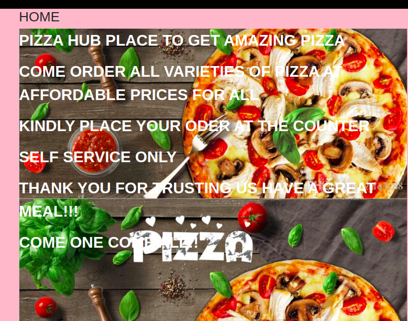
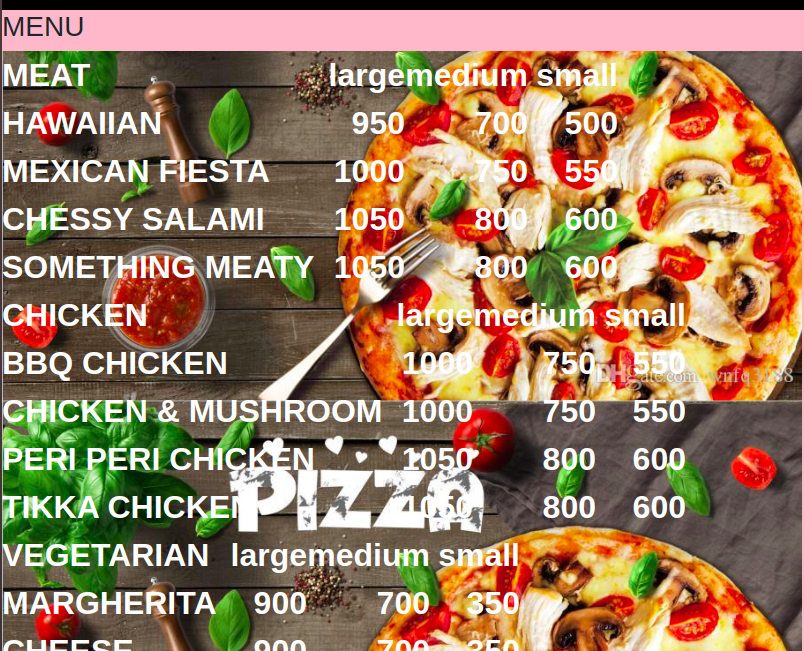
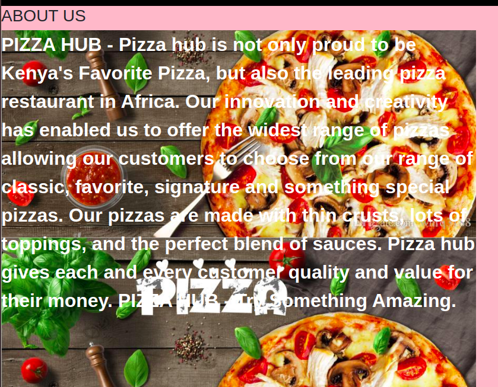
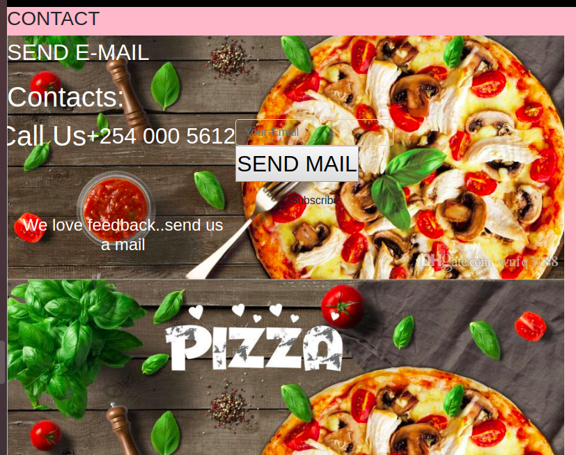

# PIZZA HUB

## AUTHOR
Pizza hub fourth week project
 * Lilian Njambi
## DESCRIPTION

This project is a website for a pizza restaurant that shows details about the services it offers, has information about the restaurant, a menu section  that enables users to choose the type and amount of pizza they would like.
## SCREENSHOT

## LIVE PAGE
https://llilian.github.io/PIZZA-HUB/
## TECHNOLOGIES USED

* HTML
* CSS
* Bootstrap
* jQuery
* markdown

## BDD
| Inputs |  Description |
| :---         |          ---: |
| Pizza Flavour   | `eg chicken-tikka`|
| Pizza size     | `eg medium`   |
| Pizza crust    | `eg flatbread crust`   |
| Pizza topping    | `eg Beef peperoni`  |
| Number of pizzas   | `eg 6`   |
| Delivery mode   | `eg No delivery`   |## CONTACT INFORMATION

If you have any questions,complains or contributions, please contact me at [njambililian93@gmail.com]

## LICENSE
* *MIT License:*
* Copyright (c) 2020 **Lilian Njambi**
